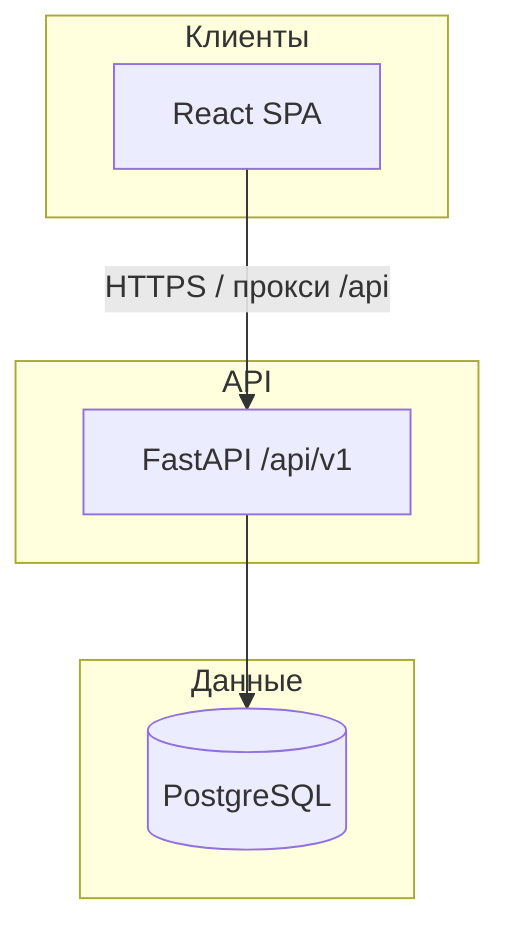

# Архитектура headhunteraapp (MVP маркетплейса)

## Назначение

Платформа сводит **компании**, которым нужны люди или бригады на объекты, с **исполнителями** (индивидуальные специалисты и бригады). Реализованы регистрация по ролям, профили, публикация **объектов/задач**, **отклики с условиями** (аналог RFQ), **переписка** по объекту и **отзывы** с пересчётом среднего рейтинга в профиле.

**Доменная модель (роли, видимость ленты/черновиков, каталог исполнителей):** см. [DOMAIN_MODEL.md](./DOMAIN_MODEL.md).

## Высокоуровневая схема

## Роли пользователя

| Роль | Таблица профиля | Основные действия |
|------|-----------------|-------------------|
| `company` | `company_profiles` | Публикация `work_objects`, просмотр откликов, смена статуса отклика, чат с исполнителем |
| `worker` | `worker_profiles` | Поиск объектов, отклик, чат с компанией, отзыв о компании |
| `brigade` | `brigade_profiles` | То же, что у работника, с точки зрения API |

Аутентификация: **JWT** в заголовке `Authorization: Bearer <token>`, пароли — **bcrypt** (пакет `bcrypt`).

## Ключевые сущности (БД)

- **`users`** — email (уникальный), `password_hash`, `role`, `is_active`.
- **`company_profiles`**, **`worker_profiles`**, **`brigade_profiles`** — расширенные поля под описание в ТЗ (города, условия, рейтинг `rating_avg`, счётчик `reviews_count`).
- **`work_objects`** — карточка объекта/задачи: адрес/регион, описание, вид работ, сроки, потребность в людях/бригадах, навыки, оплата, статус (`open` / `closed` / `cancelled`).
- **`object_responses`** — отклик на объект: автор, тип исполнителя (`worker`/`brigade`), предложенные цена/сроки/текст, статус (`pending` / `accepted` / `rejected` / `withdrawn`). Один отклик на пару (объект, пользователь).
- **`conversations`** + **`messages`** — чат, привязанный к объекту и паре «компания ↔ исполнитель».
- **`reviews`** — оценка 1–5 и комментарий; уникальность по (кто оценивает, кого, объект) при заданном `work_object_id` (для NULL объекта в PostgreSQL возможны дубликаты по ограничению — для MVP приемлемо).

## Основные HTTP-группы

| Префикс | Назначение |
|-----------|------------|
| `/api/v1/auth` | `register`, `login`, `me` |
| `/api/v1/profiles` | Публичное чтение профиля по `user_id`, PATCH своего профиля по роли |
| `/api/v1/objects` | Лента с фильтрами (`city`, `q`, `payment`, даты), CRUD объекта для компании, `GET /objects/company/mine` |
| `/api/v1/objects/{id}/responses` | Создание отклика (исполнитель), список откликов (владелец объекта) |
| `/api/v1/my/responses` | Свои отклики (исполнитель) |
| `/api/v1/responses/{id}` | PATCH статуса (компания: accepted/rejected; исполнитель: withdrawn) |
| `/api/v1/chat` | Список диалогов, создание/получение чата, сообщения |
| `/api/v1/reviews` | Создание отзыва, список отзывов о пользователе |
| `/api/v1/talent/workers`, `/talent/brigades` | Каталог исполнителей (только `company`) |
| `/api/v1/shortlist/*` | Избранные исполнители у компании |
| `/api/v1/notifications` | In-app уведомления |
| `/api/v1/organizations` | Организация (B2B), подписка free при создании |
| `/api/v1/analytics/company/summary` | Сводка по объектам и откликам |
| `/api/v1/billing/plans` | Тарифы |
| `/api/v1/integrations/*` | API-ключи и webhooks (заготовка) |
| `/api/v1/admin/stats` | Агрегаты платформы (`is_platform_admin`) |
| `/api/v1/auth/me/export`, `/auth/me/security` | Экспорт данных, флаг 2FA |

## Фронтенд

- **React Router** — маршруты: лента, карточка объекта, кабинет, профиль, создание объекта, чаты.
- Токен хранится в `localStorage`, `api/http.ts` подставляет заголовок авторизации.
- Прокси Vite пересылает `/api` на backend (см. `frontend/vite.config.ts`).

## Миграции

- `001` — историческая демо-таблица `job_applications`.
- `002` — удаление `job_applications` и создание актуальной схемы маркетплейса.

## Монетизация и расширения

Подписка и платные опции из ТЗ **не реализованы** в MVP; к ним можно добавить таблицы планов, счётчиков размещений и платёжный провайдер без ломки текущего ядра.
