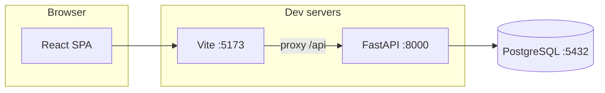

# Архитектура headhunteraapp

Документ описывает, как устроено приложение на текущем MVP и как компоненты взаимодействуют при локальном запуске.

## Обзор

В production обычно отдают собранный фронт статикой (CDN или тот же процесс/ingress) и выносят API и БД по отдельным хостам; для локальной разработки достаточно двух процессов и контейнера PostgreSQL.

## Слои

### Frontend (`frontend/`)

- **React 19** + **TypeScript**, сборка **Vite 6**.
- Единая страница: список откликов и форма создания.
- HTTP-клиент обращается к относительному пути **`/api/v1/...`**. В dev **Vite** проксирует префикс `/api` на `http://127.0.0.1:8000`, поэтому браузер не упирается в CORS при same-origin запросах к `localhost:5173`.
- Стили: инлайн-объекты + базовый `index.css` (без отдельного UI-фреймворка намеренно, чтобы уменьшить объём зависимостей).

### Backend (`backend/`)

- **FastAPI** монтирует роутер под префиксом **`/api/v1`** (см. `app/main.py`, `app/config.py`: `api_prefix`).
- **SQLAlchemy 2.x** в **async** режиме с драйвером **asyncpg**; сессия выдаётся через dependency `get_db` (`app/db.py`).
- **Pydantic v2** схемы для тела запросов/ответов (`app/schemas/`).
- Доменная модель MVP: сущность **отклик на вакансию** (`job_applications`): компания, роль, статус, заметки, даты (`app/models/job_application.py`).

Эндпоинты (все под `/api/v1`):

| Метод | Путь | Назначение |
|-------|------|------------|
| GET | `/applications` | Список откликов, новые сверху |
| POST | `/applications` | Создание |
| GET | `/applications/{id}` | Одна запись |
| PATCH | `/applications/{id}` | Частичное обновление (в т.ч. статус) |
| DELETE | `/applications/{id}` | Удаление |
| GET | `/health` | Корневой health (вне `/api`) |

### База данных

- **PostgreSQL 16** в Docker (`docker-compose.yml`): пользователь/пароль/БД `headhunter` / `headhunter` / `headhunter`, порт **5432**.
- **Alembic** миграции лежат в `backend/alembic/versions/`. Для миграций используется **синхронный** URL `DATABASE_URL_SYNC` (psycopg2); runtime API — `DATABASE_URL` с `+asyncpg`.

### Конфигурация

- `app/config.py`: **pydantic-settings**, читает `backend/.env` и при необходимости `.env` в корне репозитория.
- CORS для прямых запросов к API с `localhost:5173` (если не использовать прокси).

## Поток данных (создание отклика)

1. Пользователь заполняет форму на React и отправляет POST `/api/v1/applications`.
2. Vite прокси пересылает запрос на FastAPI.
3. FastAPI валидирует тело через Pydantic, создаёт строку в `job_applications`, коммитит сессию.
4. Ответ с созданной сущностью возвращается в браузер; UI перезагружает список через GET `/api/v1/applications`.

## Расширение продукта

Следующие шаги (не входят в MVP, но логично ложатся на эту архитектуру): аутентификация, пользователи, фильтры и поиск, интеграции с job boards, фоновые задачи (Celery/RQ), отдельные окружения через переменные окружения и CI.
